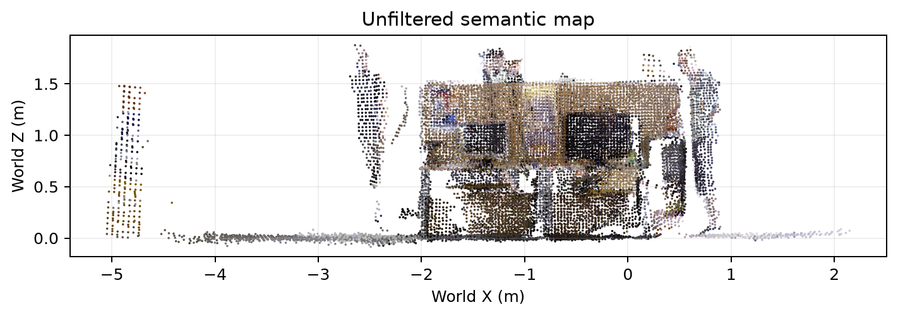
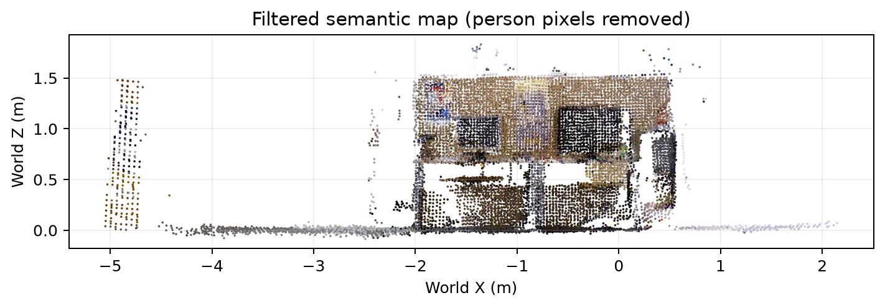

# Semantic Visual SLAM for Indoor Mobile Robot Perception

A practical robotic-vision project combining RGB-D visual SLAM, object perception, semantic 3D mapping, and dynamic-object filtering.

## Project goals

This repository turns the CV project into a reproducible implementation:

- estimate indoor camera motion with RGB-D Visual SLAM;
- detect and segment objects in RGB frames;
- project recognized objects into 3D using aligned depth;
- transform observations into a shared world frame;
- build a semantic point-cloud map;
- filter dynamic objects such as people from stable geometry;
- compare filtered and unfiltered maps;
- evaluate localization against benchmark ground truth.

## First benchmark

The first reproducible experiment uses the TUM RGB-D `freiburg3_walking_xyz` sequence. We first validate semantic mapping with ground-truth poses, then replace those poses with ORB-SLAM3 output.

## Pipeline

```text
RGB-D frames
   |
   +--> Object segmentation ----> semantic masks
   |
   +--> Visual SLAM ------------> camera poses
                                  |
depth + masks + camera poses -----+
                 |
                 v
        3D back-projection
                 |
                 v
       world-frame fusion
                 |
        +--------+--------+
        |                 |
        v                 v
 stable map        semantic objects
(dynamic pixels     class + 3D
 removed)           position
        |                 |
        +--------+--------+
                 v
             evaluation
```

## Technology stack

- ORB-SLAM3 for RGB-D visual SLAM
- Ultralytics YOLO segmentation for object perception
- Open3D for point-cloud processing and visualization
- OpenCV and NumPy for RGB-D processing and geometry
- TUM RGB-D benchmark for reproducible evaluation

ORB-SLAM3 is an external dependency and is not vendored into this repository.

## Repository layout

```text
configs/                 experiment configuration
data/                    local datasets (ignored by Git)
docs/                    milestones and experiment log
results/                 generated outputs (ignored by Git)
src/semantic_slam/       reusable Python package
tests/                   unit tests
tools/                   command-line experiment scripts
```

## Stage 1: validate semantic mapping

### 1. Create an environment

Python 3.10+ is recommended.

```bash
python -m venv .venv
```

Linux/macOS:

```bash
source .venv/bin/activate
```

Windows PowerShell:

```powershell
.venv\Scripts\Activate.ps1
```

Install:

```bash
pip install -e .
```

### 2. Add the TUM RGB-D sequence

Extract `rgbd_dataset_freiburg3_walking_xyz` under:

```text
data/rgbd_dataset_freiburg3_walking_xyz/
```

The folder should contain `rgb.txt`, `depth.txt`, `groundtruth.txt`, `rgb/`, and `depth/`.

### 3. Create RGB-depth associations

```bash
python tools/make_associations.py \
  --rgb data/rgbd_dataset_freiburg3_walking_xyz/rgb.txt \
  --depth data/rgbd_dataset_freiburg3_walking_xyz/depth.txt \
  --output data/rgbd_dataset_freiburg3_walking_xyz/associations.txt
```

### 4. Build the first semantic map with ground-truth poses

```bash
python tools/build_semantic_map.py \
  --config configs/tum_fr3_walking.yaml \
  --dataset data/rgbd_dataset_freiburg3_walking_xyz \
  --poses data/rgbd_dataset_freiburg3_walking_xyz/groundtruth.txt \
  --output results/groundtruth_map \
  --filter-dynamic
```

Expected outputs include:

```text
semantic_map.ply
object_observations.csv
frame_summary.csv
run_metadata.json
```

Run the same command without `--filter-dynamic` to create an unfiltered comparison map.

## Stage 2: ORB-SLAM3 integration

After building ORB-SLAM3, run its TUM RGB-D example and save `CameraTrajectory.txt`. Then use that file as the `--poses` input to the semantic mapper.

## Stage 3: localization evaluation

```bash
python tools/evaluate_trajectory.py \
  --estimate results/orbslam3/CameraTrajectory.txt \
  --ground-truth data/rgbd_dataset_freiburg3_walking_xyz/groundtruth.txt
```

## First benchmark result

A reproducible filtered-vs-unfiltered smoke experiment has now completed on the TUM RGB-D `freiburg3_walking_xyz` sequence using TUM ground-truth poses and a frame step of 90.

| Metric | Unfiltered | Person-filtered |
| --- | ---: | ---: |
| Processed frames | 9 | 9 |
| 3D object observations | 56 | 56 |
| Raw map points | 37,262 | 28,744 |
| Voxel-downsampled points | 20,998 | 16,396 |

Dynamic-person filtering removed **8,518 raw 3D points (22.86%)** from the sampled reconstruction while preserving the same 56 semantic object observations.

### Unfiltered semantic map



### Person-filtered semantic map



The figures above are generated automatically from the actual binary PLY outputs by `tools/render_map_preview.py`. The full filtered/unfiltered maps, CSV observations, metadata, and comparison JSON are produced by the GitHub Actions benchmark workflow.

## Research evidence we will add

- annotated detection frames;
- filtered vs unfiltered semantic maps;
- trajectory plots;
- ATE/RMSE tables;
- object observation statistics;
- viewpoint-consistency analysis;
- a live RGB-D demo;
- later, ROS 2/mobile-robot integration.

See `docs/milestones.md` for the implementation roadmap.
